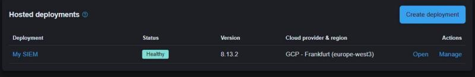
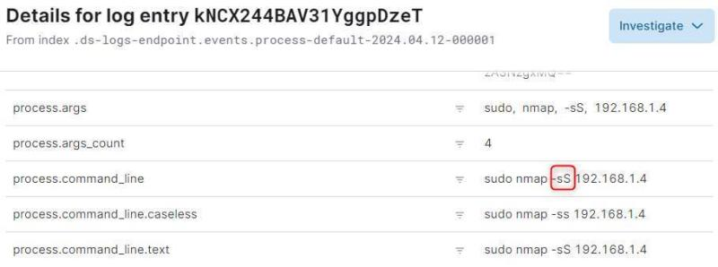
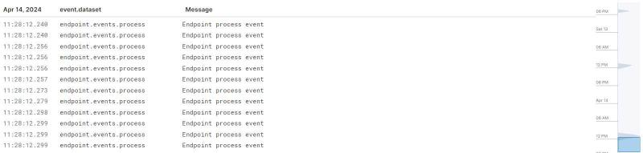
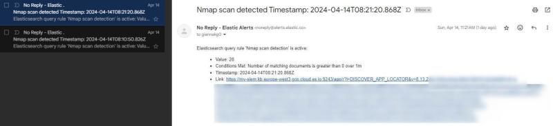

# 🔒 Homelab: Elastic SIEM with Kali Linux VM

## 📚 Overview

In this project, I set up a homelab environment using Elastic Stack's SIEM (Security Information and Event Management) and a Kali Linux VM to simulate security incidents. The goal was to configure the Elastic Agent, run vulnerability scans with `nmap`, and observe how the SIEM captures, analyzes, and alerts on these events.

This setup provided practical exposure to cybersecurity monitoring, log analysis, alerting, and threat detection using Sigma rules for threat intelligence enrichment.

---

## 🛠️ Key Components

- **Elastic Stack SIEM**: Hosted in the Elastic Cloud, used for log collection, analysis, and security monitoring.
- **Kali Linux VM**: Used to generate security events such as network scans with `nmap`.
- **Elastic Agent**: Installed on the Kali VM to ship data back to Elastic SIEM.
- **Nmap**: Used to simulate network attacks and security scanning.
- **Sigma Rules**: For detecting and enriching the SIEM's threat intelligence.

---

## 📝 Setup Process

### 1. ☁️ Elastic Cloud Deployment

- Signed up for Elastic Cloud's free trial.
- Created a new deployment with Elasticsearch and Kibana.
- Monitored the deployment's health and status. Below is the screenshot of the Elastic deployment in my environment:

  

### 2. 🖥️ Kali Linux Setup

- Downloaded and installed Kali Linux in VirtualBox.
- After configuring the network and basic settings, installed the **Elastic Agent** on the VM to forward security events to Elastic Stack.

### 3. 🔍 Security Event Generation

- On the Kali Linux VM, I used `nmap` to run network scans. The scan results were logged by the Elastic Agent and forwarded to the SIEM for analysis.
  
  Example of an `nmap` scan event captured in the logs:
  
  

- Here is a view of the raw logs of the security events processed:

  

### 4. 📣 Alert Configuration

- Configured custom rules in Elastic SIEM to alert me on any suspicious activity. The alert was triggered when multiple `nmap` scan events were detected, indicating potential network reconnaissance.

  Below is a screenshot of the alert email I received after configuring a detection rule:

  

### 5. 📊 Visualizations & Dashboards

- Created visualizations and a dashboard in the Elastic web interface to represent security event data graphically.

---

## 🎓 Lessons Learned

- **Hands-on SIEM**: Got practical exposure to deploying and managing a SIEM platform.
- **Alerting and Monitoring**: Learned how to configure alerts and use custom rules to detect potential threats.
- **Threat Intelligence**: Used Sigma rules to integrate threat intelligence and detect new vulnerabilities.
- **Log Analysis**: Gained experience in analyzing and querying logs for specific events.

---

## 🔧 Technologies Used

- [Elastic Stack](https://www.elastic.co/) 🌐
- [Kali Linux](https://www.kali.org/) 🐉
- [Nmap](https://nmap.org/) 🔍
- [VirtualBox](https://www.virtualbox.org/) 🖥️
- [Sigma Rules](https://github.com/SigmaHQ/sigma-specification)📜

---

## 🏁 Conclusion

This homelab project gave me a deeper understanding of security monitoring and event management with Elastic Stack SIEM. By simulating attacks in Kali Linux, I gained insights into how security threats can be detected, analyzed, and mitigated in a real-world environment.
